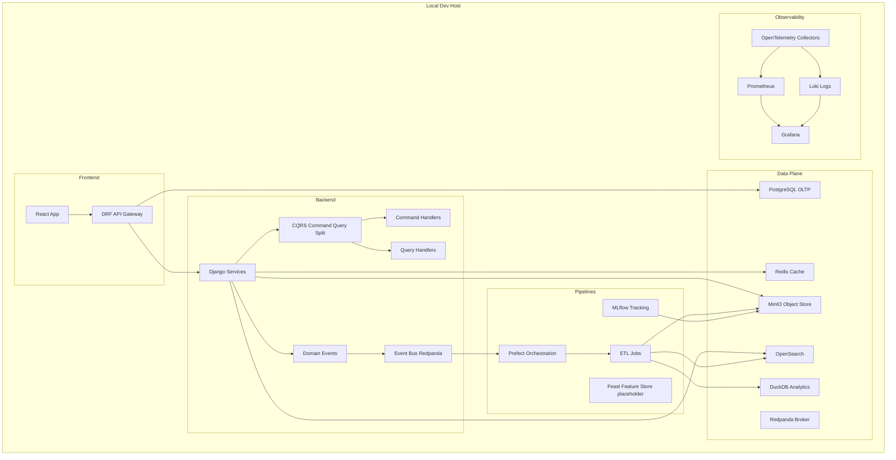

# Healthcare Analytics — Local, Cloud‑Ready (Python + LinkML + Django/DRF + React + Zod + Recharts)

A **cloud‑free but cloud‑ready** analytics platform for the healthcare domain featuring **Data Engineering** and **Data Science** workflows. It uses a **schema‑first** approach with **LinkML**, clean architecture with **Repository / Unit of Work / CQRS / Strategy / Decorator**, and a modern **React + Zod + Recharts** frontend. Everything runs locally via **Docker Compose**; resources are **destroyable** with one command.

---

## What You Get

- **Backend**: Django 5 + DRF, OpenAPI (drf-spectacular), Postgres 16, Redis cache
- **Data Plane**: MinIO (S3‑compatible), OpenSearch 2.15, DuckDB marts, Redpanda (Kafka‑compatible)
- **Pipelines**: Prefect 2 flows, ETL to DuckDB and OpenSearch, MLflow tracking
- **Frontend**: React + TypeScript, Zod runtime validation, Recharts charts, Webpack dev server
- **Observability**: Prometheus + Grafana + Loki (configs included), OTel‑friendly layout
- **CI**: GitHub Actions workflow for backend checks and frontend build
- **Seed Data**: realistic‑ish Patient, Provider, Encounter, Observation, MedicationOrder, LabResult CSVs
- **Schema‑first**: LinkML model with healthcare entities and relations

---

## Architecture (strict‑safe Mermaid v10)



---

## Quick Start

1. **Clone & env**
   ```bash
   cp .env.example .env
   ```


2. 
✅ Option 1 — Use PowerShell / Command Prompt directly
# Start the whole stack

docker compose up -d --build

# Run the seed loader inside the backend container

docker compose exec backend bash -lc "python -m pipelines.etl.load_seed"


# Build DuckDB marts

docker compose exec backend bash -lc "python -m pipelines.etl.to_duckdb"


Then open:

DRF API → http://localhost:8000/api/

React UI → http://localhost:5173/


3. 
To stop and clean up:

docker compose down
docker compose down -v

===================================================
2. **Run stack**
   ```bash
   make up
   ```

3. **Seed data & build marts**
   ```bash
   make seed
   make marts
   ```
===================================================

4. **Open UIs**
   - DRF API Root: `http://localhost:8000/api/`
   - OpenAPI Docs: `http://localhost:8000/api/docs/`
   - Frontend: `http://localhost:5173/`
   - MLflow: `http://localhost:5000/`
   - Grafana: `http://localhost:3000/`
   - Prometheus: `http://localhost:9090/`
   - Prefect UI: `http://localhost:4200/`
   - MinIO console: `http://localhost:9001/` (user: `minio`, pass: `minio12345`)

5. **Tear down**
   ```bash
   make down         # stop
   make clean        # stop + remove volumes and local artifacts
   ```

> Everything is **local**; no cloud services are called. The layout is intentionally **cloud‑ready**, so you can later swap MinIO→S3, Redpanda→MSK/Kafka, OpenSearch→Amazon OpenSearch, etc.

---

## Repository Layout

```
.
├─ metadata/                # LinkML schema + CSV seeds
├─ backend/                 # Django + DRF project (clean architecture-ish folders)
├─ frontend/                # React + TypeScript + Webpack + Zod + Recharts
├─ pipelines/               # Prefect flows + ETL to DuckDB and OpenSearch + ML script
├─ observability/           # Prometheus and Loki configs
├─ .github/workflows/       # CI pipeline
├─ docker-compose.yml       # Local stack
└─ Makefile                 # One-liners
```

- **LinkML**: `metadata/schema.linkml.yaml` models
  - Patient ↔ Encounter ↔ Observation / MedicationOrder / LabResult; Encounter ↔ Provider
- **CSV seeds**: `metadata/seed/*.csv` populate core entities for demos and charts.

---

## Backend (Django + DRF)

- URLS:
  - `/api/patients/`, `/api/providers/`, `/api/encounters/`, `/api/observations/`, `/api/medications/`, `/api/labs/`
  - `/api/schema/` OpenAPI JSON, `/api/docs/` Swagger UI
- Patterns used:
  - **Repository + Unit of Work** for controlled writes
  - **CQRS** split for commands/queries (handlers scaffolded)
  - **Strategy** for pluggable ingestion (CSV shown; add Parquet, FHIR, HL7, etc.)
  - **Decorator** for retries/metrics around I/O

**Migrations**: on container start we run `manage.py migrate`. Admin enabled at `/admin`.

---

## Frontend (React + Zod + Recharts + Webpack)

- `PatientForm.tsx` validates with **Zod** then POSTs to `/api/patients/`.
- `ChartsDashboard.tsx` fetches `/api/observations/?code=BP_SYS` and renders a **Recharts** line chart.
- Dev server proxies `/api` to backend, so CORS is painless in dev.

---

## Data Engineering & Science

- **Prefect flow**: `pipelines/prefect/flows.py` → `nightly_build()` runs `load_all → build_marts → index_search`.
- **DuckDB marts**: `pipelines/etl/to_duckdb.py` builds `bp_by_patient` view.
- **OpenSearch**: `pipelines/etl/to_opensearch.py` indexes patients for fast search.
- **MLflow**: `pipelines/ml/train_readmissions.py` logs a simple Logistic Regression and its AUC.

Run ad‑hoc:
```bash
docker compose exec backend bash -lc "python -m pipelines.prefect.flows"
docker compose exec backend bash -lc "python -m pipelines.ml.train_readmissions"
```

---

## Observability

- **Prometheus** and **Grafana** are wired with starter configs.
- Add Django metrics via `prometheus-client` and a simple `/metrics` view if needed.
- Loki config is provided to get you started (hook your app logs as needed).

---

## Configuration

- Copy `.env.example` → `.env`. Defaults work for local dev.
- **Security**: synthetic data only; do not ingest PHI. Add DRF SimpleJWT before using real auth.
- **CORS**: enabled for all origins in dev via `django-cors-headers`.

---

## Common Tasks

```bash
make up          # build and start all services
make seed        # load CSV seeds into Postgres via Django models
make marts       # generate DuckDB marts and views
make down        # stop containers
make clean       # stop + remove volumes and temp files
```

**CI (GitHub Actions)** runs backend checks and frontend build on push/PR.

---

## Extending the Platform

- **Auth**: add DRF SimpleJWT + refresh token rotation.
- **Feature Store**: wire Feast to Postgres (offline) + Redis (online).
- **LinkML Codegen**: add a script to generate Django models/serializers from LinkML classes.
- **FHIR/HL7 Ingestion**: implement Strategy adapters for healthcare standards.
- **Advanced Viz**: add cohort builders, KPI dashboards, and anomaly detectors.

---

## Troubleshooting

- Ports already in use → change in `.env` and `docker-compose.yml`.
- Can’t access `http://localhost:5173` → ensure frontend has built and started successfully.
- OpenSearch connection issues → it may take ~10–20s to become available after `make up`.

---

## License

MIT‑style for templates and scaffolding. Verify licenses of upstream images/libraries before production use.
